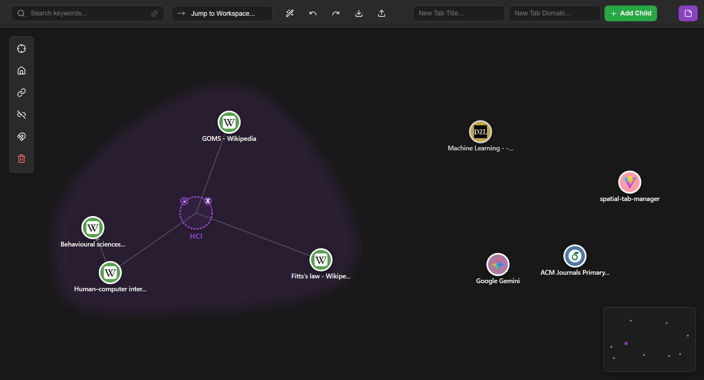

```markdown
# Spatial Tab Manager
**A Graph-Based Approach to Web Browsing**



## 📖 Overview

Spatial Tab Manager is a Chrome Extension that reimagines the browser interface. Instead of a linear, compressed tab strip, it provides an infinite 2D canvas where tabs serve as physics-enabled nodes.

This project addresses "Tab Overload" by utilizing spatial memory and force-directed graphs. It automatically links tabs based on browsing history (provenance), allows for semantic clustering into "Workspaces," and utilizes a high-performance D3.js simulation to make tab management fluid and intuitive.

## ✨ Key Features

- 🕸️ **Living Graph**: Tabs are treated as active nodes in a physics simulation.
- 🔗 **Auto-Context Linking**: Automatically creates links between tabs based on browsing history (e.g., opening a link from a Google search creates a visual connection).
- 📂 **Dynamic Workspaces**: Visually group related tabs into "Nebula" clusters with organic boundaries.
- ⚡ **Navigation Accelerators**:
  - **Peek Mode**: Hold Spacebar to zoom out and glance at the whole graph.
  - **Command Palette**: Press `Ctrl+K` for keyboard-driven management.
  - **WASD Navigation**: Pan across the canvas without the mouse.
- 🧠 **Semantic Search**: Searching highlights not just the tab, but the entire cluster of related context.
- 🧹 **Auto-Group**: Algorithmic helper to instantly tidy up messy canvases by domain.

## 🛠️ Tech Stack

- **Frontend Framework**: React (Vite)
- **Visualization Engine**: D3.js (d3-force)
- **Platform**: Google Chrome Extension (Manifest V3)
- **State Management**: React Hooks + LocalStorage Persistence

## 🚀 Installation & Setup

Since this extension is built with Vite and React, it must be compiled before it can be loaded into Chrome.

### 1. Clone and Install

```bash
git clone https://github.com/rohan879/Spatial-Tab-Manager.git
cd Spatial-Tab-Manager
npm install
```

### 2. Build the Project

Run the build script to generate the static files.

```bash
npm run build
```

This will create a `dist` folder in your project root containing the compiled extension.

### 3. Load into Chrome

1. Open Google Chrome and navigate to `chrome://extensions`.
2. Enable **Developer mode** (toggle switch in the top right corner).
3. Click the **Load unpacked** button.
4. Select the `dist` folder located inside your project directory.

The extension is now installed! Open a new tab to see the Spatial Tab Manager in action.

## 🎮 Controls

| Action | Input |
|--------|-------|
| Pan Canvas | Click & Drag Background / `W` `A` `S` `D` keys |
| Zoom | Mouse Scroll Wheel |
| Open Tab | Click on a Node |
| Move Tab | Drag a Node |
| Peek Mode | Hold `Spacebar` (Zoom to fit) |
| Command Palette | `Ctrl + K` (Windows/Linux) or `Cmd + K` (Mac) |
| Undo Action | `Ctrl + Z` |

## 🏗️ Architecture

The project uses a hybrid architecture to ensure performance even with 100+ active tabs.

- **React Layer**: Handles UI state, search bars, menus, and browser API interactions.
- **D3 Layer**: Bypasses React's virtual DOM for the physics simulation, rendering directly to an SVG canvas for maximum speed.
